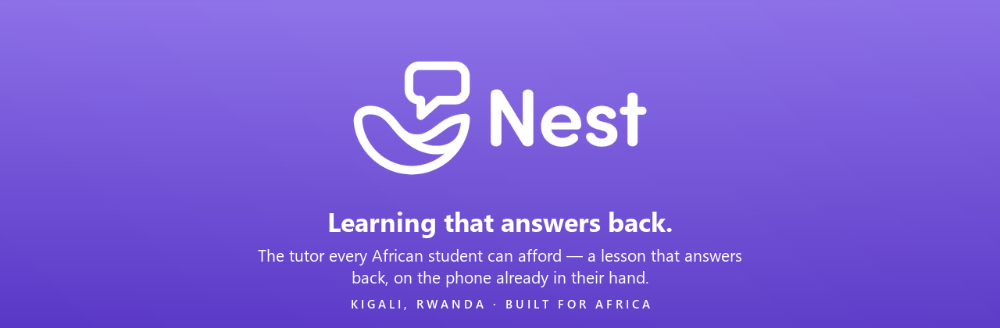

<div align="center">



<br/>

# Nest

### The tutor every African student can afford. A lesson that answers back.

Nest turns a video lesson into a conversation. A student watches a short lesson, taps the exact
second they get lost, and asks a question. The answer comes back **grounded in that specific
lesson**, not a generic web result. Built mobile-first, bilingual, and mobile-money native, for
students and exam-prep learners across Africa.

<br/>

[](https://nest-com.vercel.app)
[](https://nest-com.onrender.com)


</div>

---

## Why Nest exists

Across Africa a student's future is decided by exams they are systematically under-prepared for.
The best teaching sits behind private tutoring most families can't afford, classrooms hold 60+
students to one teacher, and existing online learning is built for a laptop and a credit card:
passive video with **no one to ask when you get stuck**.

Nest closes that gap. The moment a student is confused is the moment learning either happens or
dies, so Nest makes the lesson itself answer back.

> **One line:** *Nest is the tutor every African student can afford. A lesson that answers back, on the phone already in their hand.*

---

## What makes it different

|  | Generic video platforms | **Nest** |
|---|---|---|
| The moment of confusion | You're on your own | **Ask at the exact second, answered from that lesson** |
| Device | Desktop-first | **Mobile-first, built for slow data & low-end Android** |
| Language | English-only | **English + French** |
| Payment | Card required | **Mobile money, no bank card needed** |
| Educators | Faceless | **Local tutors, publish courses & get paid** |

The moat isn't a single feature. It's the whole system being built natively for the African
student, end to end, with a two-sided flywheel: students get affordable help, tutors earn income,
and each side pulls the other in.

---

## Product

Nest is a **live, working platform**, not a prototype.

### For learners
- 📺 **Short video lessons**, built for attention spans and data budgets
- ⏱️ **Timestamped Q&A**: pin a question to the exact second; a scrubber pin marks it
- 🤖 **AI answers from the transcript**, grounded in the lesson rather than a generic chatbot
- 📝 **Quizzes & assignments**: practice, worked examples, and graded work with a rich editor
- 📊 **Progress tracking & streaks**: completion per module, and momentum kept
- 🎓 **Certificates**: earn a shareable certificate on course completion
- 📅 **Live meetings**: scheduled sessions with educators
- 🔔 **Real-time notifications**: WebSocket push for answers, approvals, and updates

### For educators & schools
- 🎬 **Publish courses**: upload lessons, auto-transcription, build quizzes & assignments
- ✉️ **Scoped invitations**: invite a learner to one module or all, with time-bounded access
- 💳 **Mobile-money payments**: proof-of-payment submission with an admin approval flow
- 🏫 **Branded org spaces**: a school runs its own logo/colour learning space on Nest
- 📈 **Admin dashboard**: analytics, pending queues, resolution metrics, user management
- 💼 **Careers / ATS**: a built-in application pipeline (`/careers`)

<!--
  📸 PRODUCT SCREENSHOTS
  Drop real screenshots into docs/ (e.g. docs/shot-lesson.png, docs/shot-dashboard.png,
  docs/shot-qa.png) and uncomment the block below. Phone-frame captures look best.

  <div align="center">
    
    
    
  </div>
-->

---

## Tech stack

| Layer | Technology |
|---|---|
| **Frontend** | React 18 · TypeScript · Vite 5 · Tailwind CSS · Zustand · TanStack Query · React Router |
| **Editor / content** | TipTap (rich text) · KaTeX (math, lazy-loaded) · Recharts (analytics) · DOMPurify (sanitisation) |
| **Backend** | FastAPI · SQLAlchemy 2 · Pydantic v2 · WebSockets · SlowAPI (rate limiting) |
| **Database** | PostgreSQL (Supabase) in production · SQLite locally |
| **AI** | Transcript-aware Q&A plus a platform assistant (LLM) |
| **Auth** | bcrypt password hashing · JWT (HS256, hardcoded algorithm) · httpOnly cookie |
| **Storage** | Supabase (videos, thumbnails, uploads) |
| **Email** | SendGrid / Resend (HTTP API) |
| **Payments** | Mobile money (MTN · Airtel · Orange): proof-of-payment plus approval |
| **Hosting** | Vercel (frontend) · Render (backend) · Supabase (DB) |
| **PWA** | Installable, offline-resilient service worker (network-first HTML, cache-first hashed assets) |

---

## Quick start

**Prerequisites:** Python 3.11+ · Node.js 18+

### Backend
```bash
cd backend
cp .env.example .env          # set SECRET_KEY, DATABASE_URL, AI + email keys
pip install -r requirements.txt
uvicorn main:app --reload --port 8000
```
API docs (dev only): http://localhost:8000/api/docs

### Frontend
```bash
cd frontend
npm install
npm run dev
```
App: http://localhost:5173

> On Windows you can run both at once with `./start-dev.sh` (Git Bash), or Docker with
> `docker-compose up`.

---

## Roles

| Role | Can do |
|---|---|
| **Learner** | Watch lessons, ask timestamped questions, take quizzes/assignments, earn certificates |
| **Educator** | Publish courses, answer questions, grade work, run meetings, invite learners |
| **Admin / Owner** | Approve payments, manage users, view analytics, brand the org space |
| **Super Admin** | Full cross-org management |

---

## Architecture

```
nest.com/
├── backend/                    # FastAPI
│   ├── main.py                 # app entry, middleware, security headers, startup migrations
│   ├── models.py               # SQLAlchemy ORM
│   ├── schemas.py              # Pydantic request/response models
│   ├── auth.py                 # bcrypt + JWT (HS256), login/register/reset
│   ├── access.py               # single source of truth for module access checks
│   ├── config.py               # settings; refuses to boot on a weak SECRET_KEY in prod
│   └── routers/
│       ├── auth · organizations · invitations      # accounts, orgs, scoped invites
│       ├── modules · lessons · videos · quiz        # content
│       ├── questions · ai_assist · transcription    # Q&A + AI + transcripts
│       ├── assignments · notes · certificates       # coursework
│       ├── meetings · search · progress             # sessions, discovery, tracking
│       ├── payments · analytics · admin             # money, dashboards, ops
│       ├── ats                                       # careers / applications
│       └── ws.py                                     # WebSocket connection manager
│
└── frontend/                   # React + TypeScript + Vite
    ├── public/                 # PWA manifest, service worker, brand assets
    └── src/
        ├── components/
        │   ├── VideoPlayer/    # custom player, ImmersiveMobilePlayer, timeline
        │   ├── QA/  ModuleLibrary/  NestAssistant/  Layout/  UI/
        ├── pages/              # Landing, Login, Modules, Video, admin/*, Careers, …
        ├── store/              # Zustand (auth, player, UI)
        ├── api/                # Axios client
        └── hooks/              # WebSocket, query invalidation
```

---

## Security

- 🔐 **bcrypt** password hashing; **JWT HS256** with the algorithm hardcoded, not env-swappable
- 🎯 **Scoped, time-bounded access**: an invited guest reaches only what they were invited to, and access expires; enforced by rows, never a global flag
- 🛡️ **CSP, HSTS (2yr + preload), Permissions-Policy** security headers
- ⏳ **Rate limiting** on all auth, AI, and payment endpoints (SlowAPI)
- 🧼 **DOMPurify** sanitisation on all AI-rendered HTML
- 🚫 **API docs disabled in production**; payment approval restricted to owner/super-admin
- 🔑 **Config refuses to boot** on a weak `SECRET_KEY` in production

---

## Impact

Every learner helped is a trajectory changed; every tutor paid is a livelihood created.

**SDG 4** Quality Education · **SDG 8** Decent Work & Growth · **SDG 10** Reduced Inequalities

Nest makes passing an exam no longer depend on a family's income or postcode.

---

<div align="center">

**Nest**: a classroom with no walls.
Built in Kigali, Rwanda, for students across Africa.

[nest-com.vercel.app](https://nest-com.vercel.app)

</div>
